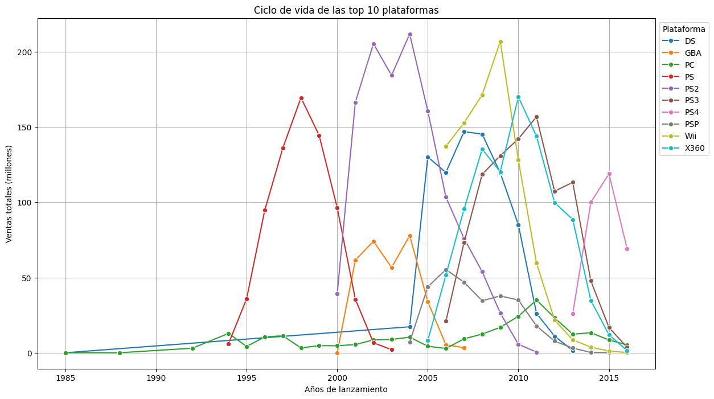
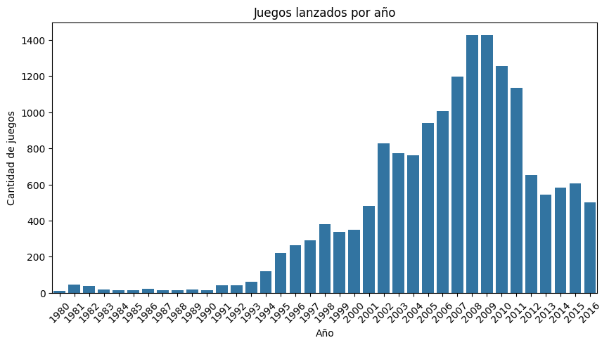

# Hola, soy Feliciano Rodríguez

## Data Scientist Jr

## Sobre mi

Soy Data Scientist en formación, con base en Ingeniería en Desarrollo y Gestión de Software. Me enfoco en construir soluciones con datos usando Python y SQL, desde el análisis exploratorio hasta modelos aplicados a problemas reales.

Actualmente desarrollo proyectos de análisis de datos, machine learning y deep learning con datasets reales para identificar patrones, entrenar modelos y convertir resultados en soluciones útiles para producto.

Mi experiencia en desarrollo de software me ayuda a trabajar de forma estructurada, pensando no solo en el modelo, sino también en cómo implementarlo dentro de productos y aplicaciones que funcionen.

Intereses principales:

- Machine Learning
- Deep Learning
- AI
- Productos que funcionen

## Tecnologias y herramientas

- Lenguajes: Python, SQL
- Librerias: pandas, numpy, scikit-learn, matplotlib, seaborn
- Bases de datos: MySQL, PostgreSQL
- Entorno: Jupyter Notebook, VS Code, Git, GitHub, Docker
- Backend: Flask, FastAPI

## Proyectos destacados

### 1) Análisis de preferencias de pasajeros (Zuber, empresa ficticia)

Descripción:
Análisis de datos de una empresa de viajes compartidos para identificar patrones de comportamiento de pasajeros.

Que hice:

- Obtuve datos sobre el clima en Chicago en un sitio web con las librerías de python Request, BeautifulSoup, Pandas.
- Analisis exploratorio (EDA) a una base de datos PostgreSQL, para conocer la preferencia de los viajeros y como las condiciones del clima cambian los viajes.
- Aplicar pruebas de hipótesis con las ayuda de la librería SciPy para probar la diferencia en los viajes los días luviosos y no lluvioso.
- Evaluacion con ROC-AUC, precision, recall y matriz de confusion

Resultados:

Este gráfico muestra los viajes totales registrados por empresa de taxis.

Este gráfico muestra los principales barrios en terminos de finalización del viaje. Se puede ver los principales barrios a los que la gente va.

- Se descubrieron las preferencias de los usuarios, los barrios a en los que los usuarios suelen terminar su viaje y que compaías de taxi son las que dominan el mercado.
- Gracias a las pruebas estadísticas se puedo concluir que entre los viajes los días lluviosos y los días no luviosos si existe una diferencia significativa como para tratarse de simple casualidad.

Repositorio:

- [08_zuber](https://github.com/FelicianoRodriguez/tripleten-projects/tree/main/08_zeros)

### 2) Identificación de patrones que determinan si un juego tendra éxito o no (Tienda Online Ice)

Descripción:

Este proyecto analiza datos históricos de ventas de videojuegos de la tienda online Ice, que distribuye videojuegos a nivel mundial. El dataset incluye información sobre títulos, plataformas, géneros, ventas por región, calificaciones de usuarios y críticas de expertos, así como clasificaciones de contenido (ESRB).

El objetivo del análisis es identificar patrones que ayuden a determinar qué factores influyen en el éxito comercial de un videojuego, con el fin de detectar proyectos prometedores y apoyar la planificación de campañas de marketing.

Que hice:

Para abordar el problema se realizó un análisis exploratorio de datos (EDA) utilizando Python.

Primero se llevó a cabo un proceso de preparación y limpieza de datos, que incluyó:
• estandarización de nombres de columnas
• conversión de tipos de datos
• tratamiento de valores faltantes
• cálculo de ventas globales a partir de las ventas regionales

Posteriormente se exploraron diferentes dimensiones del dataset para identificar tendencias relevantes:
• evolución del número de videojuegos lanzados por año
• análisis de ventas por plataforma y su ciclo de vida en el mercado
• identificación de las plataformas más relevantes en el período reciente del dataset
• análisis de la relación entre calificaciones de usuarios, críticas y ventas
• comparación de géneros y su desempeño comercial

También se realizó un análisis por región (Norteamérica, Europa y Japón) para identificar diferencias en las preferencias de los jugadores según el mercado.

Finalmente, se plantearon y evaluaron hipótesis estadísticas relacionadas con las calificaciones promedio entre plataformas y géneros.

Resultados:

Este gráfico muestra el ciclo de vida de las 10 principales plataformas en terminos de ventas totales. Se puede apreciar como para el caso del PlayStation, cada generación sustituye a la otra.

Este gráfico muestra la cantidad de juegos lanzados por cada año. Se puede ver como en 2008 y 2009 se lanzaron más juegos, pero en la actulidad el número se ha venido reducido, posiblemente se debe a que lo juegos de la actualidad son más robustos y detallados.

El análisis permitió identificar varios factores asociados al éxito comercial de los videojuegos.

Se observó que las plataformas tienen ciclos de vida definidos, donde las ventas crecen durante ciertos años y luego disminuyen a medida que nuevas generaciones de consolas entran al mercado.

También se identificó que algunos géneros tienen mayor demanda dependiendo de la región, mostrando diferencias claras en las preferencias de los jugadores en Norteamérica, Europa y Japón.

Además, el análisis mostró que las calificaciones de críticos y usuarios pueden tener cierta relación con el rendimiento comercial de los juegos, aunque no siempre determinan completamente el éxito de un título.

Estos hallazgos pueden ayudar a identificar tendencias del mercado y apoyar la toma de decisiones en campañas de marketing o lanzamiento de videojuegos.

Repositorio:

- [06_store_ice](https://github.com/FelicianoRodriguez/tripleten-projects/tree/main/06_store_ice)

## Contacto

- Gmail: felicianorodriguezlp@gmail.com
- LinkedIn: https://www.linkedin.com/in/feliciano-rodriguez/
